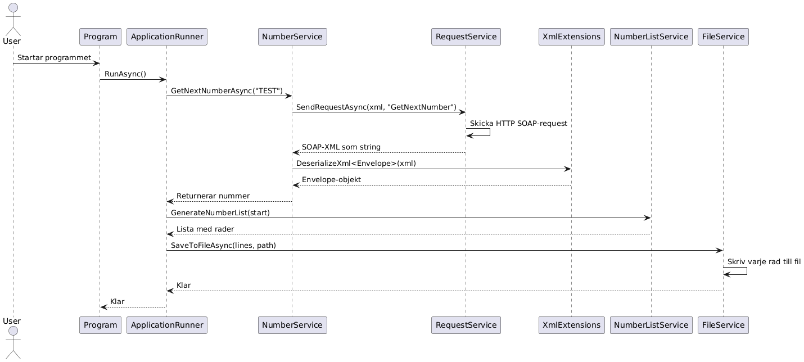

# GetNextNumber

Detta är en .NET-konsolapplikation som anropar InfoSolutions SOAP-tjänst `GetNextNumber`, skapar en lista med de 100 följande numren och markerar multiplar av 3, 5 eller båda. Resultatet skrivs ut i terminalen och sparas i `log.txt`.

## Arkitektur
Programmet följer SOLID-principerna. Här är ett sekvensdiagram över flödet:

